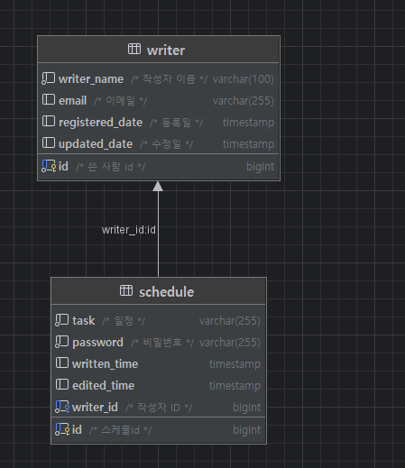

### Schedule API

| 기능 | Method | URL | Request | Response | 상태 코드 |
|------|--------|-----|---------|----------|----------|
| 일정 생성 | POST | `/schedules` | `{ "task": "string", "writerName": "string", "password": "string" }` | `{"id": "number", "task": "string", "writerName": "string", "writtenDate": "string", "editedDate": "string" }` | `201 Created` |
| 모든 일정 조회 | GET | `/schedules` | None | `[ScheduleResponseDto]` | `200 OK` |
| ID로 일정 조회 | GET | `/schedules/{id}` | None | `ScheduleResponseDto` | `200 OK`, `404 Not Found` |
| 작성자명으로 일정 조회 | GET | `/schedules/writer/{writerName}` | None | `ScheduleResponseDto` | `200 OK`, `404 Not Found` |
| 날짜로 일정 조회 | GET | `/schedules/date/{date}` | None | `[ScheduleResponseDto]` | `200 OK`, `400 Bad Request` |
| 필터에 따른 일정 조회 | GET | `/schedules/filtered` | `?editedDate={editedDate}&writerName={writerName}` | `[ScheduleResponseDto]` | `200 OK` |
| 일정 업데이트 | PUT | `/schedules/{id}` | `{ "task": "string", "writerName": "string", "password": "string" }` | `ScheduleResponseDto` | `200 OK`, `401 Unauthorized` |
| 작성자명 업데이트 | PATCH | `/schedules/{id}` | `{ "writerName": "string" }` | `ScheduleResponseDto` | `200 OK`, `400 Bad Request`, `404 Not Found` |
| 일정 삭제 | DELETE | `/schedules/{id}` | `{ "password": "string" }` | None | `204 No Content`, `401 Unauthorized` |

### Writer API

| 기능 | Method | URL | Request | Response | 상태 코드 |
|------|--------|-----|---------|----------|----------|
| 작성자 생성 | POST | `/writers` | `{ "name": "string", "email": "string" }` | `Long` (작성자 ID) | `201 Created` |
| 작성자 ID로 조회 | GET | `/writers/{id}` | None | `WriterDto` | `200 OK`, `404 Not Found` |